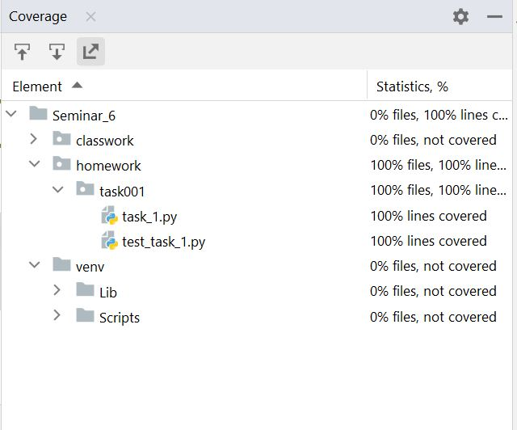

# Урок 6. Юнит тестирование в других языках

### task001:

Задание 1. Создайте программу на Python или Java, которая принимает два списка чисел и выполняет следующие действия:
a. Рассчитывает среднее значение каждого списка.
b. Сравнивает эти средние значения и выводит соответствующее сообщение:

- ""Первый список имеет большее среднее значение"", если среднее значение первого списка больше.
- ""Второй список имеет большее среднее значение"", если среднее значение второго списка больше.
- ""Средние значения равны"", если средние значения списков равны.

Важно:
Приложение должно быть написано в соответствии с принципами объектно-ориентированного программирования.
Используйте Pytest (для Python) или JUnit (для Java) для написания тестов, которые проверяют правильность работы
программы. Тесты должны учитывать различные сценарии использования вашего приложения.
Используйте pylint (для Python) или Checkstyle (для Java) для проверки качества кода.

#### Решение:

Сгенерируйте отчет о покрытии кода тестами. Ваша цель - достичь минимум 90% покрытия.

#### Решение:

Объяснение того, какие сценарии покрыты тестами и почему вы выбрали именно эти сценарии.

#### Решение:

К каждой функции прикреплена документация. Данные сценарии выбраны так как в них наиболее вероятна ошибка.
